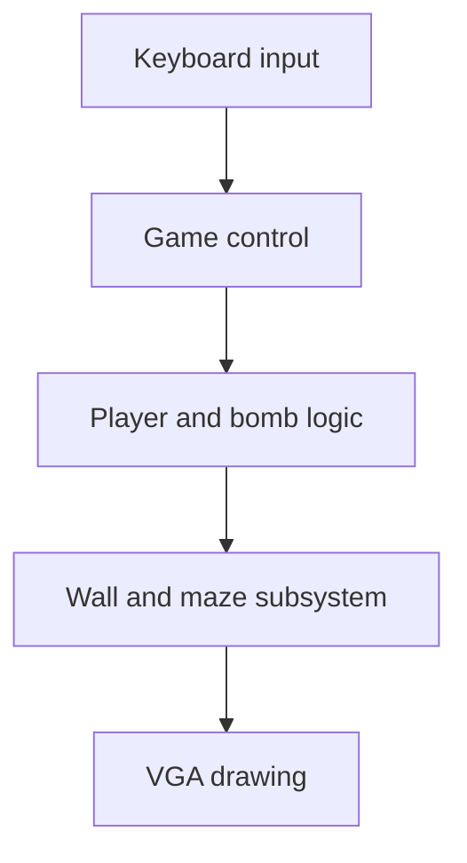

# Bomberman FPGA Game

A two-person course project for Electrical Engineering Laboratory 1A (044157) at the Technion, completed in 2025. The team built a Bomberman-style game as a hierarchical digital system targeting an Intel Cyclone V FPGA. The archived design combines SystemVerilog modules and Quartus block diagrams for VGA graphics, keyboard input, game logic, bombs, walls, scoring, and audio.

This repository is a curated source snapshot from the final Quartus archive. It documents my individual contribution to the maze and wall subsystem as well as its place in the team project.

## My contribution: maze and wall subsystem

I designed the `WallsBlock` subsystem, with its core logic in [`WallsMatrixBitMap.sv`](quartus/RTL/VGA/WallsMatrixBitMap.sv) and schematic integration in [`WallsBlock.bdf`](quartus/RTL/VGA/WallsBlock.bdf).

- Represented the maze as a **15 × 15 grid of 5-bit tile types**, with separate level layouts. The design maps VGA pixel coordinates to tiles and selects 32 × 32 bitmap pixels for display.
- Converted player and bomb positions into grid coordinates and exposed wall type, RGB/drawing requests, and collision-related outputs to the rest of the game.
- Updated destructible tiles on explosion pulses. The logic changes a stronger wall to a weaker wall, then clears it on a later hit, and emits a `wallBreak` event.
- Integrated the wall subsystem into the team game through the Quartus top-level block diagram.

### Hardware debugging

The team used Quartus SignalTap to inspect the bomb coordinates and their mapped tile position in hardware. The captured trace helped identify and correct an offset between the bomb's screen position and its maze cell. The course report documents this debugging step; the archive contains SignalTap configuration files, including [`stp4.stp`](quartus/stp4.stp).

## System context

The diagram is a simplified view of the relevant data path. The archived design also contains audio, enemies, scoring, timers, and other graphical blocks. This was a team project; the wall and maze subsystem described above was my assigned module.

## Source layout

| Path | Contents |
| --- | --- |
| `quartus/RTL/VGA/WallsMatrixBitMap.sv` | Maze grid, tile drawing, coordinate mapping, and explosion-driven wall updates |
| `quartus/RTL/VGA/WallsBlock.bdf` | Schematic wrapper for the wall subsystem |
| `quartus/RTL/VGA/TOP_VGA_DEMO_KBD.bdf` | Team top-level integration |
| `quartus/RTL/` | Other team and course-provided modules and graphical assets |
| `quartus/stp*.stp` | Quartus SignalTap configurations |
| `quartus/Lab1Demo.qpf`, `quartus/Lab1Demo.qsf` | Original Quartus project settings |

## Toolchain and build status

The project settings specify **Quartus Prime Lite 17.0**, the **Cyclone V 5CSXFC6D6F31C6** device, and `TOP_VGA_DEMO_KBD` as the top-level entity. To inspect the design, open `quartus/Lab1Demo.qpf` with Quartus and follow the hierarchy from the top-level block diagram to `WallsBlock`.

This is a historical source snapshot, **not a verified clean build** from this repository. The original archive had stale `.qsf` references to `RTL/VGA/timer1.sv`, `RTL/VGA/Org_Hart.bdf`, and `scorebitmap`; these entries were removed from this curated copy. Programming chain files and waveform files containing local computer paths were also omitted. Some remaining source files are course starter material or generated IP. No automated test suite is included in this snapshot; the documented hardware debugging evidence is the SignalTap capture in the original report.

## Attribution

This project was completed by a two-student team using Technion course material and Intel Quartus IP. Existing copyright and attribution headers remain with their files. The README identifies my specific subsystem and does not claim authorship of every module in the archive. No repository-wide open-source license is asserted for third-party or team code.
